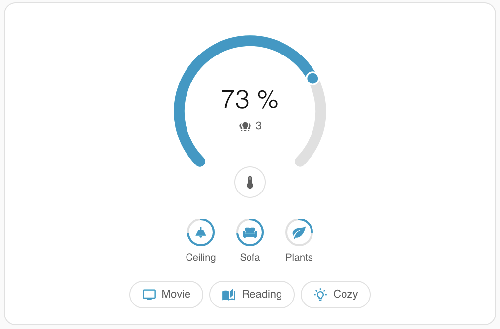
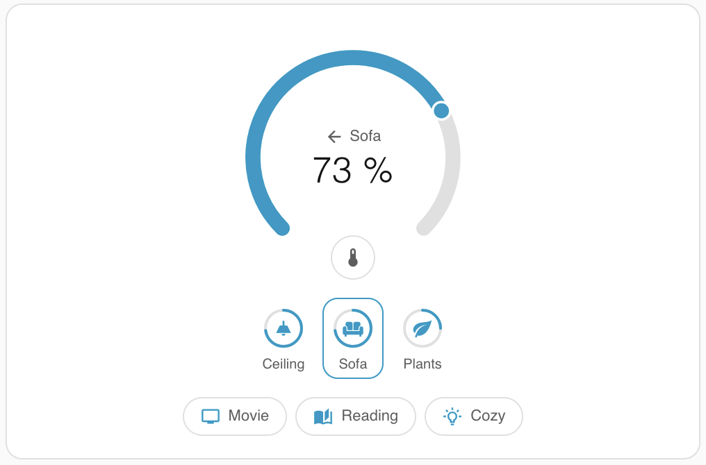
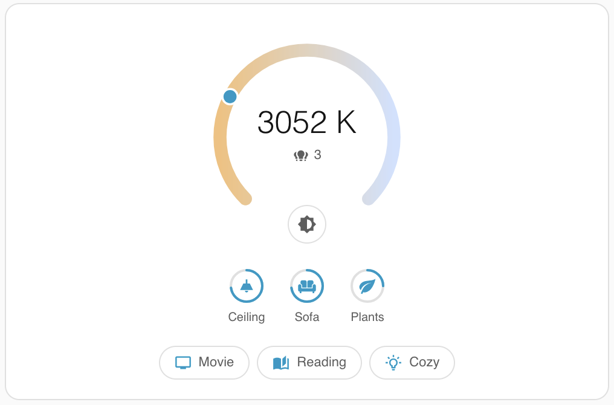
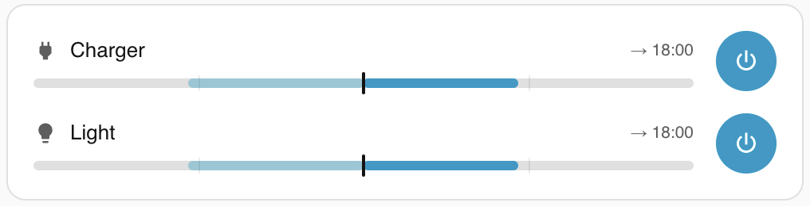
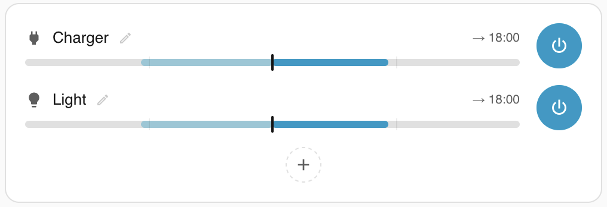
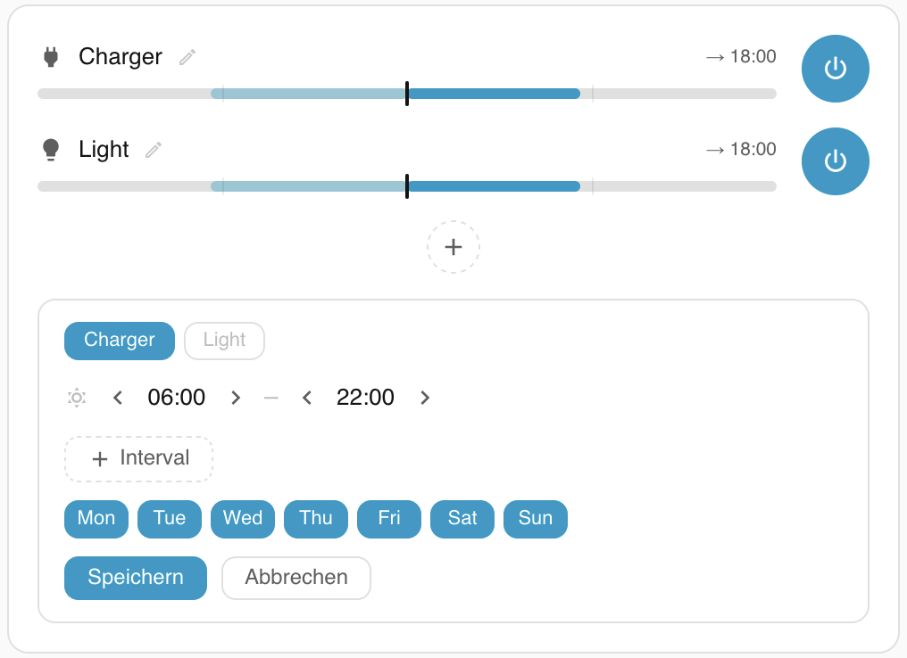

# 🛋️ Lovelace Sweetwater Cards

[](https://github.com/hacs/integration)
[](https://my.home-assistant.io/redirect/hacs_repository/?owner=h4llow3En&repository=lovelace-sweetwater-cards&category=plugin)

An elegant Lovelace card bundle for Home Assistant.

---

## Installation

### HACS (recommended)

Add this repository as a custom repository in HACS (type: **Lovelace**), then install *Lovelace Sweetwater Cards*.

### Manual

1. Download `sweetwater-cards.js` from the [latest release](https://github.com/h4llow3En/lovelace-sweetwater-cards/releases/latest) and copy it to `config/www/`
2. Add the resource in `configuration.yaml`:

```yaml
lovelace:
  resources:
    - url: /local/sweetwater-cards.js
      type: module
```

---

## Cards Overview

The *Lovelace Sweetwater Cards* bundle currently includes the following cards:

- **SW Room Card** (`custom:sw-room-card`): An elegant, area-aware room overview card that auto-discovers entities (lights, window sensors, temperature) and renders a 24h temperature graph.
- **SW Tab Card** (`custom:sw-tab-card`): A clean, flexible container card to define reusable nested cards and switch between them seamlessly.
- **SW Climate Card** (`custom:sw-climate-card`): A compact horizontal card for rooms that shows current temperature, humidity and a 24h background wave graph. Optionally controls a climate thermostat (target temperature stepper + HVAC mode pills).
- **SW Light Card** (`custom:sw-light-card`): A room light dial with a single 270° arc that proportionally dims all lights that are currently on, plus per-light chips to toggle or fine-tune individual lights and an optional color temperature mode.
- **SW Schedule Card** (`custom:sw-schedule-card`): A now-centered ±12 h timeline for [scheduler-component](https://github.com/nielsfaber/scheduler-component) schedules, with a boost/pause override per schedule and inline editing of simple on/off schemes.

---

## 1. SW Room Card

An elegant, area-aware room overview card.

- Auto-discovers entities from a Home Assistant area (lights, window sensors, temperature)
- Derives floor label and icon from the area automatically
- Renders a 24 h temperature graph from history data
- Flexible `rows` system for status indicators without hardcoded entity types
- Works with any HA theme; all colours are overridable per card

---

### Minimal config

<p align="center">
  
  
</p>

```yaml
type: custom:sw-room-card
area: living_room
```

With only `area` set, the card auto-discovers the room name, floor, icon, and temperature sensor. If none are found, those sections are simply omitted.

---

### Full config reference

<p align="center">
  
</p>

```yaml
type: custom:sw-room-card

# ── Identity ──────────────────────────────────────────────────
area: living_room          # HA area slug. Drives auto-discovery.
name: "Living Room"        # Override area name. Use 'none' to hide.
floor: "Ground Floor"      # Override floor label. Use 'none' to hide.
                           # Auto-derived from hass.floors if area is set.
icon: mdi:sofa             # Override area icon. Use 'none' to hide.
                           # Auto-derived from area.icon if area is set.
align: left                # Header alignment: 'left' (default), 'center', or 'right'.
                           # Aligns icon, name, and floor label.

# ── Temperature & graph ────────────────────────────────────────
temp_entity: sensor.living_room_temperature
                           # Entity to show as temperature and graph.
                           # Auto-discovered (first device_class: temperature
                           # in area, then first climate entity).
                           # Set to 'none' to disable both temp and graph.
humidity_entity: sensor.living_room_humidity
                           # Optional. Shows humidity smaller + right-aligned
                           # next to the temperature. Not shown by default.
                           # Set to 'none' to explicitly disable.
                           # Use show.humidity: true to auto-discover from area.
hours_to_show: 24          # How many hours of history the graph covers.
                           # Default: 24

# ── Visibility ─────────────────────────────────────────────────
show:
  icon: true               # Room icon
  name: true               # Room name
  floor: true              # Floor label
  temp: true               # Temperature value
  humidity: false          # Humidity value (default false, opt in explicitly)
  graph: true              # History graph
  rows: true               # All status rows

# ── Action ─────────────────────────────────────────────────────
tap_action:
  action: more-info        # Default: opens more-info for the temp entity.
                           # Also supports: navigate, url, toggle,
                           # call-service, none.
  entity: sensor.xyz       # Override entity for more-info / toggle.
                           # Defaults to temp_entity.
  navigation_path: /lovelace/home   # For action: navigate
  url_path: https://...             # For action: url
  service: light.turn_on            # For action: call-service
  service_data: {}                  # For action: call-service

# ── Status rows ────────────────────────────────────────────────
rows:
  - type: lights           # See row types below
  - type: windows
  - type: custom
    label: Bike
    content: [...]

# ── Theming ────────────────────────────────────────────────────
styles:                    # Per-card CSS variable overrides. Short keys are
  color: "#c9a96e"         # expanded to --sw-room-card-<key> automatically.
  font: "'Cormorant Garamond', serif"
  height: "260px"
```

> **`show` vs `none`**: both work independently. `show.icon: false` and `icon: none` both hide the icon. Either is fine. Use whichever reads more clearly for your use case.

> **Humidity** is opt-in: it is hidden unless you set `humidity_entity` explicitly or add `show: { humidity: true }` (which enables auto-discovery from the area).

---

### Row types

#### `lights`

One dot per light entity. Dot is lit in the primary accent colour when the light is on.

```yaml
- type: lights
  label: "Light"           # Optional. Default: localised via hass.localize
                           # ('component.light.entity_component._.name'
                           #  → e.g. "Light" / "Licht")
  entities:                # Optional. Default: all lights in the area.
    - light.living_room_ceiling
    - light.floor_lamp
```

#### `windows`

One dot per binary sensor with `device_class: window`, `door`, or `garage_door`. Dot uses the secondary accent colour when open; square shape to distinguish from lights.

```yaml
- type: windows
  label: "Window"          # Optional. Default: localised via hass.localize
                           # ('component.binary_sensor.entity_component.window.name'
                           #  → e.g. "Window" / "Fenster")
  entities:                # Optional. Default: auto from area.
    - binary_sensor.window_east
    - binary_sensor.balcony_door
```

#### `custom`

Compose a row from any combination of entity values and dots. Replaces the need for dedicated `switch`, `sensor`, or `bike` row types.

```yaml
- type: custom
  label: "Label"
  show: true                                 # Set to false to hide this row. Default: true.
  content:
    - entity: some.entity_id
      display: dot                           # 'dot' (default) or 'value'
      # --- dot options ---
      color_on: "var(--sw-room-card-color)"     # Dot colour when state is 'on'
      color_off: "var(--sw-room-card-inactive)"
      shape: circle                          # 'circle' (default) or 'square'
      pulse: true                            # Animate opacity when on. Default: false.
      # --- value options ---
      unit: "%"                              # Unit override (default: entity unit_of_measurement)
      warn_above: 1000                       # Show value in warning colour above this threshold.
                                             # Default: none (no warning).
      color_warn: "var(--sw-room-card-warn)"    # Warning colour override
```

**Examples**

Bike charging status:
```yaml
- type: custom
  label: "Fahrrad"
  content:
    - entity: sensor.bike_battery_level
      display: value
    - entity: binary_sensor.bike_battery_charging
      display: dot
      color_on: "var(--sw-room-card-ok)"
      pulse: true           # Pulses while actively charging
```

CO₂ sensor with warning:
```yaml
- type: custom
  label: "CO₂"
  content:
    - entity: sensor.office_co2
      display: value
      warn_above: 1000
```

Occupancy & Motion:
```yaml
- type: custom
  label: "Presence"
  content:
    - entity: binary_sensor.living_room_occupancy
      display: dot
      color_on: "var(--sw-room-card-color)"
    - entity: binary_sensor.living_room_motion
      display: dot
      pulse: true
```

Climate & Appliances:
```yaml
- type: custom
  label: "Climate"
  content:
    - entity: sensor.living_room_humidity
      display: value
      warn_above: 60
    - entity: switch.dehumidifier
      display: dot
      color_on: "var(--sw-room-card-color-2)"
      pulse: true
```

---

### Theming

The card uses HA's standard CSS variables by default, so it works correctly with any theme without configuration.

All colours are exposed as `--sw-room-card-*` custom properties on `:host` for per-card overrides.

| Property | Default | Purpose |
|---|---|---|
| `--sw-room-card-color` | `--primary-color` | Accent (graph, active dots, icon) |
| `--sw-room-card-color-2` | `--info-color` | Secondary accent (open window dots) |
| `--sw-room-card-ok` | `--success-color` | Success / charged state |
| `--sw-room-card-warn` | `--warning-color` | Warning threshold values |
| `--sw-room-card-error` | `--error-color` | Error states |
| `--sw-room-card-text` | `--primary-text-color` | Name, temperature |
| `--sw-room-card-text-secondary` | `--secondary-text-color` | Value text in rows |
| `--sw-room-card-text-disabled` | `--disabled-text-color` | Floor label, row labels |
| `--sw-room-card-inactive` | `--divider-color` | Inactive / off dot colour |
| `--sw-room-card-font` | `--primary-font-family` | All text |
| `--sw-room-card-height` | `240px` | Card height |
| `--sw-room-card-graph-height` | `60px` | Height of the temperature graph |
| `--sw-room-card-graph-width` | `1px` | Stroke width of the graph line |

Override any of these per card using the built-in `styles` key:

```yaml
type: custom:sw-room-card
area: living_room
styles:
  color: "#c9a96e"
  font: "'Cormorant Garamond', serif"
  height: "260px"
```

Short keys (e.g. `color`) are automatically expanded to `--sw-room-card-color`. You can also pass the full property name:

```yaml
styles:
  --sw-room-card-color: "#c9a96e"
```
---

### Auto-discovery details

When `area` is set, the card reads from the HA entity and device registries at runtime.

| Field | Logic |
|---|---|
| `name` | `area.name` |
| `floor` | `hass.floors[area.floor_id].name` |
| `icon` | `area.icon` |
| `temp_entity` | First `sensor.*` with `device_class: temperature` in area → first `climate.*` → none |
| `rows: lights` entities | All `light.*` entities whose `area_id` matches (direct or via device) |
| `rows: windows` entities | All `binary_sensor.*` with `device_class` of `window`, `door`, or `garage_door` |

Any field can be overridden manually. Auto-discovery results in nothing being shown (not an error) when no matching entity is found.

---

### History cache

History data is fetched via the HA WebSocket API (`history/history_during_period`) and cached per entity+duration for **5 minutes**. The cache is shared across all instances of the card on the same page, so multiple cards using the same entity incur only one fetch.

---

## 2. SW Tab Card

A clean and flexible tab container card that lets you define reusable cards and switch between them without reloading state.

<p align="center">
  
</p>

```yaml
type: custom:sw-tab-card
tabs:
  - label: "Overview"
    icon: mdi:home
    cards: ["living_room", "kitchen"]
  - label: "Climate"
    icon: mdi:thermometer
    cards: ["thermostat"]
cards:
  living_room:
    type: custom:sw-room-card
    area: living_room
  kitchen:
    type: custom:sw-room-card
    area: kitchen
  thermostat:
    type: thermostat
    entity: climate.living_room
```

### Options

| Key | Type | Description |
|---|---|---|
| `tabs` | list | List of tab definitions. See below. |
| `cards` | object | Key-value map of card definitions (reusable by name). |
| `title` | string | Optional title shown next to the tabs. |
| `title_align` | string | `left` (default), `center`, or `right`. Alignment of the title. |
| `tab_align` | string | `left` (default), `center`, or `right`. Alignment of the tabs. |
| `tab_style` | string | `pills` (default), `underline`, or `dropdown`. |
| `columns` | number / string | Number of fixed columns for cards, or `'auto'` (default). |
| `min_column_width` | number | Minimum card width for auto grid in pixels. Default `180`. |
| `styles` | object | Per-card CSS overrides (e.g., `accent`, `radius`, `font-size`, `title-size`). Expanded to `--sw-tab-<key>`. |

### Tab Definition (`tabs`)

| Key | Type | Description |
|---|---|---|
| `label` | string | Optional text shown on the tab. |
| `icon` | string | Optional MDI icon (e.g., `mdi:home`). |
| `cards` | list | List of card keys from `cards` object to render when active. |

### Theming (`styles`)

The `styles` key lets you easily override the internal CSS variables of the tab selector without using `card_mod`:

```yaml
type: custom:sw-tab-card
styles:
  accent: "#c9a96e"      # Active tab background/color
  radius: "12px"         # Border radius for pills
  font-size: "14px"      # Tab text size
tabs:
  # ...
```
Short keys are automatically expanded to `--sw-tab-<key>`.

### Examples

**Title and Dropdown Style**

<p align="center">
  
</p>

```yaml
type: custom:sw-tab-card
title: "Ground Floor"
title_align: left
tab_style: dropdown
tabs:
  - label: "Living Room"
    icon: mdi:sofa
    cards: ["living_room"]
  - label: "Kitchen"
    icon: mdi:fridge
    cards: ["kitchen"]
cards:
  # ... card definitions ...
```

**Underline Style (Centered)**

<p align="center">
  
</p>

```yaml
type: custom:sw-tab-card
tab_style: underline
tab_align: center
tabs:
  - label: "Status"
  - label: "Settings"
cards:
  # ... card definitions ...
```

---

## 3. SW Climate Card

A compact horizontal card designed for room popups. It shows the current temperature, humidity and an optional 24 h background wave graph. When a `climate_entity` is supplied, the right side renders a target-temperature stepper and HVAC mode pills. Rooms without a thermostat simply omit the controls; no extra configuration is needed.

<p align="center">
  
</p>

---

### Minimal config

**Sensor-only** (no thermostat; temperature + humidity + graph):

<p align="center">
  
</p>

```yaml
type: custom:sw-climate-card
temp_entity: sensor.living_room_temperature
humidity_entity: sensor.living_room_humidity
```

**With thermostat** (adds stepper and mode pills on the right):

<p align="center">
  
</p>

```yaml
type: custom:sw-climate-card
climate_entity: climate.living_room
temp_entity: sensor.living_room_temperature
humidity_entity: sensor.living_room_humidity
```

**Climate entity only** (no dedicated sensors; temperature, humidity and graph are all derived from `climate_entity` attributes):

```yaml
type: custom:sw-climate-card
climate_entity: climate.living_room
```

---

### Full config reference

```yaml
type: custom:sw-climate-card

# ── Labels ────────────────────────────────────────────────────
title: "Living Room"       # Optional title shown top-left in uppercase.
                           # Intended for standalone use; omit inside a
                           # Bubble popup that already shows the room name.

# ── Entities ─────────────────────────────────────────────────
climate_entity: climate.living_room
                           # Optional. Required for thermostat controls
                           # (stepper + mode pills).
                           # Also used as fallback for temp / humidity
                           # values via current_temperature /
                           # current_humidity attributes.
temp_entity: sensor.living_room_temperature
                           # Optional. Shown as the main temperature value
                           # (left side). Also drives the history graph.
                           # Fallback: climate_entity.current_temperature.
humidity_entity: sensor.living_room_humidity
                           # Optional. Shown smaller next to the temperature.
                           # Fallback: climate_entity.current_humidity.
hours_to_show: 24          # Hours of history for the background graph.
                           # Default: 24.

# ── Mode filter ───────────────────────────────────────────────
modes: [off, heat, auto]   # Optional. Restrict mode pills to this subset
                           # of entity.hvac_modes. If omitted, all modes
                           # reported by the entity are shown.
mode_icons:                # Optional. Override the icon for any mode.
  heat: mdi:fire           # Defaults are listed in the Theming section.
  off: mdi:power
  auto: mdi:autorenew

# ── Visibility ────────────────────────────────────────────────
show:
  graph: true              # Background wave graph. Default: true.
  humidity: true           # Humidity value. Default: true.
  controls: false          # Force controls visible even when no
                           # climate_entity is configured (rendered
                           # greyed out). Default: false.

# ── Interactions ──────────────────────────────────────────────
hold_action:               # Action fired after holding the card for ~500 ms.
  action: none             # Default: none. Supported actions:
                           #   none | more-info | navigate | url |
                           #   toggle | call-service
  entity: climate.x        # Entity for more-info / toggle (defaults to
                           # climate_entity when not set)
  navigation_path: /lovelace/room
  url_path: https://...
  service: light.turn_on
  service_data: {}

# ── Theming ───────────────────────────────────────────────────
styles:                    # Per-card CSS variable overrides. Short keys
  color: "#c9a96e"         # expand to --sw-climate-<key> automatically.
  height: "140px"
```

---

### Data resolution

The card resolves display values in this order:

| Value | Source (in order) |
|---|---|
| Temperature display | `temp_entity.state` → `climate_entity.attributes.current_temperature` → hidden |
| Humidity display | `humidity_entity.state` → `climate_entity.attributes.current_humidity` → hidden |
| Target temperature | `climate_entity.attributes.temperature` |
| Current mode | `climate_entity.state` |
| History graph | `temp_entity` sensor history → `climate_entity.attributes.current_temperature` history (attribute-based fetch) → no graph |

---

### HeatControl (thermostat controls)

The right side of the card renders when a `climate_entity` is set (or `show.controls: true`).

#### Target temperature stepper

```
◀  21.5°  ▶
```

- Step: **0.5 °** per tap.
- Clamped to `min_temp` / `max_temp` from the entity attributes.
- Tap an arrow → calls `climate.set_temperature` and shows the new value immediately (optimistic update). The display returns to the entity value once HA confirms the change.
- Tap the temperature value itself → opens the `more-info` dialog for `climate_entity`.
- Stepper and temperature are dimmed when mode is `off`.

#### Mode pills

One compact icon button per available HVAC mode. The active mode is highlighted with the accent colour.

Default icons (all overridable via `mode_icons:`):

| Mode | Default icon |
|---|---|
| `off` | `mdi:power` |
| `heat` | `mdi:fire` |
| `cool` | `mdi:snowflake` |
| `auto` | `mdi:autorenew` |
| `heat_cool` | `mdi:autorenew` |
| `dry` | `mdi:water-percent` |
| `fan_only` | `mdi:fan` |

Tap a pill → calls `climate.set_hvac_mode`.

---

### Usage in a room popup

The intended placement is as the second card inside a Bubble Card popup, directly below the popup header:

```yaml
- type: vertical-stack
  cards:
    - <<: *popup_room
      name: Living Room
      icon: mdi:sofa
      hash: "#room-living_room"
    - type: custom:sw-climate-card
      climate_entity: climate.living_room
      temp_entity: sensor.living_room_temperature
      humidity_entity: sensor.living_room_humidity
    # … scene strip, sw-tab-card with lights/sensors, …
```

Rooms **without** a controllable thermostat (e.g. kitchen, basement) simply omit `climate_entity`:

```yaml
- type: custom:sw-climate-card
  temp_entity: sensor.kitchen_temperature
  humidity_entity: sensor.kitchen_humidity
```

No `show:` toggles are needed; the controls section is hidden automatically.

---

### Theming

All colours are exposed as `--sw-climate-*` custom properties on `:host` for per-card overrides. HA theme variables are used as defaults, so no configuration is required with any standard theme.

| Property | Default | Purpose |
|---|---|---|
| `--sw-climate-color` | `--primary-color` | Accent (active mode pill background, graph fill) |
| `--sw-climate-active-text` | `--text-primary-color` | Text/icon colour on the active mode pill (contrasts with `--sw-climate-color`) |
| `--sw-climate-text` | `--primary-text-color` | Main temperature value |
| `--sw-climate-text-secondary` | `--secondary-text-color` | Humidity, target temperature, stepper arrows |
| `--sw-climate-text-disabled` | `--disabled-text-color` | Inactive mode pills, title label |
| `--sw-climate-border` | `--divider-color` | Mode pill border |
| `--sw-climate-font` | `--primary-font-family` | All text |
| `--sw-climate-height` | `120px` | Card height |
| `--sw-climate-graph-height` | `100%` | Height of the background graph (fills the full card) |
| `--sw-climate-graph-width` | `0px` | Graph stroke width (`0px` means fill only, no line) |

Override any of these per card using the `styles` key:

```yaml
type: custom:sw-climate-card
climate_entity: climate.living_room
styles:
  color: "#c9a96e"
  height: "140px"
  graph-width: "0.5px"   # thin stroke on top of the fill
```

Short keys (e.g. `color`) are automatically expanded to `--sw-climate-color`. Full property names are passed through as-is:

```yaml
styles:
  --sw-climate-color: "#c9a96e"
```

---

## 4. SW Light Card

A room-level light control: one arc dial for every light that is currently **on**, plus a chip per light.

<p align="center">
  
  
  
</p>

### Behavior

- **Release-only**: dragging shows a local preview; the `light.turn_on` calls fire when you let go. Touching the dial never turns a light on by accident.
- **Proportional master dimming**: on drag start the card snapshots the current levels of all lights that are on and scales them proportionally (ceiling 80 % + sofa 30 %, master halved → 40 % + 15 %). Scene moods survive re-dimming. The master value shown is the **max** of the lights that are on.
- **Master to 0** sends a plain `light.turn_off` to every light that is on. There is no dim-down beforehand, so each light keeps its previous brightness for the next turn-on.
- **Dragging up while everything is off** turns on only the **main light** (`main_entity`, default: first light) at the dragged level.
- **Center tap**: any light on → all off; all off → the main light turns on at its device-side last level.
- **Chip tap** toggles that light; **chip hold (500 ms)** enters *single-light mode*, in which the dial controls only that light with its absolute value. This intentionally defines a new ratio for future master dimming. Exit via center tap (shows a back arrow) or automatically after 30 s.
- **Color temperature mode**: the mode button below the dial (shown only when a target light supports `color_temp`) switches the dial to a warm↔cold gradient. Master color temp is **absolute**: one Kelvin value is applied to all lights that are on, since proportional Kelvin has no perceptual meaning. Values are clamped to each light's own range.
- **Scenes**: an optional pill row below the light chips with one pill per configured scene. A tap calls `scene.turn_on` (with `transition`, default 1 s). There is no active-state detection; scenes are momentary presets.
- On/off-only lights have no brightness ring and are excluded from the percentage math, but follow master off / center toggle.

### Full config reference

```yaml
type: custom:sw-light-card

name: "Living Room"        # Optional small uppercase title.
area: living_room          # Auto-discovers all light.* entities in the area.
entities:                  # Explicit list, overrides area discovery.
  - light.ceiling          # String form, or:
  - entity: light.shelf    # Object form with per-chip overrides
    name: Shelf            # (object form is YAML-only; the visual editor
    icon: mdi:bookshelf    #  flattens it to entity ids when edited there).
main_entity: light.ceiling # Turn-on target when all lights are off.
                           # Default: first light of the list/discovery.
scenes:                    # Optional scene pills below the light chips.
  - scene.bright           # String form, or object form with per-pill
  - entity: scene.cozy     # name/icon overrides (YAML-only, like entities).
    name: Cozy
    icon: mdi:sofa
transition: 1              # Seconds for scene.turn_on (0 = no transition).
show_color_temp: true      # default true; the mode button additionally
                           # requires at least one color_temp-capable light.
styles:                    # Theming, see below.
  color: var(--accent)
```

### Theming

| Property | Default | Purpose |
|---|---|---|
| `--sw-light-card-color` | `--primary-color` | Arc fill, thumb, active chips |
| `--sw-light-card-track` | `--divider-color` | Arc track, chip ring track |
| `--sw-light-card-text` | `--primary-text-color` | Center value |
| `--sw-light-card-text-secondary` | `--secondary-text-color` | Center sub-line, chip names |
| `--sw-light-card-text-disabled` | `--disabled-text-color` | Off-state icons, title |
| `--sw-light-card-border` | `--divider-color` | Mode button border |
| `--sw-light-card-chip-bg` | `transparent` | Mode button / selected chip background |
| `--sw-light-card-font` | `--primary-font-family` | Font |
| `--sw-light-card-dial-size` | `180px` | Dial diameter |
| `--sw-light-card-ct-warm` / `-ct-cold` | `#f5c07a` / `#cfe2ff` | Color-temp gradient ends |

Short keys in `styles:` (e.g. `color`) expand to `--sw-light-card-color`; full `--sw-light-card-*` names pass through as-is.

---

## 5. SW Schedule Card

A timeline view for schedules created by the [nielsfaber scheduler-component](https://github.com/nielsfaber/scheduler-component) (`switch.schedule_*` entities). **Requires that integration**: the card renders and edits its schedules, it is not a scheduler itself.

<p align="center">
  
  
</p>
<p align="center">
  
</p>

### Behavior

- **Timeline**: a rolling 24 h window with **"now" always centered** (±12 h left/right). "On" periods render as filled spans (past dimmed), single-time-point schedules as dots. Refreshes every 30 s.
- **Override button** per schedule: a **tap boosts**, meaning the schedule's target entities toggle immediately and the schedule takes over again at its next slot. A **hold (500 ms) pauses or resumes** the schedule (`switch.turn_off/on` on the schedule switch). Paused rows are dimmed and show a pause icon.
- **Edit mode**: a **long-press on the card** toggles edit mode (auto-exits after 60 s of inactivity). Only then do the add button, ghost rows and pencil icons appear, so the everyday view stays clean. The override button's own hold (pause) is unaffected.
- **Inline editor** (edit mode): rows with a pencil icon are editable. Tapping one opens a compact editor for *simple* schedules (on/off scheme, fixed times, one target entity) with on-window time steppers, additional windows, weekday chips and a delete action. Saving regenerates a contiguous slot partition (explicit off-slots between the on-windows) via `scheduler.edit`. Complex schedules (sun-based times, non-toggle actions, multiple targets) are display-only. Tapping a row outside edit mode, or a non-editable row, opens the schedule switch's more-info dialog.
- **Creation** (edit mode): a centered **+** button opens the editor with a target picker for all configured entities (default 06:00-22:00 daily, saved via `scheduler.add`); entities without any schedule additionally get a ghost row as a shortcut.
- Full schedule objects are fetched via the `scheduler/item` websocket command before editing, so stored fields survive a roundtrip. Slot conditions are not editable here and are dropped when a conditioned schedule is saved, so leave those to the scheduler integration UI.

### Full config reference

```yaml
type: custom:sw-schedule-card

name: "Zeitplan"             # Optional small uppercase title.
entities:                    # Show schedules controlling these entities
  - light.plant_shelf        # and offer creation for uncovered ones.
  - entity: switch.greenhouse_plug
    name: Greenhouse         # Optional per-entity label/icon overrides
    icon: mdi:sprout         # (object form is YAML-only; the visual editor
                             #  flattens it to entity ids when edited there).
schedules:                   # Alternative: explicit schedule switches
  - switch.schedule_a1b2c3   # (overrides the entity/tag filter).
tags: [plants]               # Alternative: filter by scheduler tags.
discover: false              # true = list ALL schedules when no filter is set.
time_step: 15                # Editor stepper granularity in minutes.
styles:
  fill: linear-gradient(90deg, #7eb8c9, #c9a96e)
```

With none of `entities` / `schedules` / `tags` set, the card shows nothing. Set `discover: true` to list every schedule of the installation.

### Theming

| Property | Default | Purpose |
|---|---|---|
| `--sw-schedule-card-color` | `--primary-color` | Accent (active override, save button, day chips) |
| `--sw-schedule-card-fill` | `--sw-schedule-card-color` | Timeline span fill (accepts gradients) |
| `--sw-schedule-card-track` | `--divider-color` | Timeline track |
| `--sw-schedule-card-text` / `-text-secondary` / `-text-disabled` | HA text vars | Text levels, now-marker |
| `--sw-schedule-card-border` | `--divider-color` | Buttons, editor frame |
| `--sw-schedule-card-chip-bg` | `transparent` | Override button / chip background |
| `--sw-schedule-card-font` | `--primary-font-family` | Font |

Short keys in `styles:` (e.g. `fill`) expand to `--sw-schedule-card-fill`; full names pass through as-is.

> **Compatibility note**: scheduler-component v3.3.7+ renamed the action key from `service` to `action` in some payloads. The card mirrors whatever key style it reads back from the integration and defaults to `service` when creating. If `scheduler.add` rejects the payload on your version, please open an issue.
